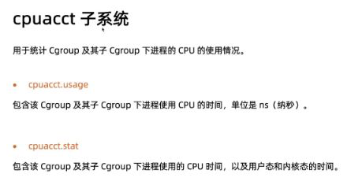
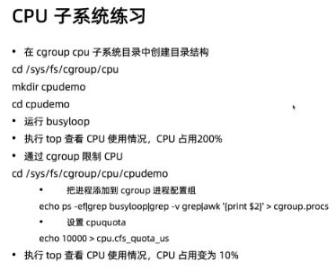

= cpu cgroup

/sys/fs/cgroup/cpu

. `cpu.cfs_period_us` cpu 配的周期(微秒),默认为100000

. `cpu.cfs_quota_us` 表示该control group限制占用的时间（微秒），默认为-1，表示不限制。如果设为50000，表示占用50000/10000=50%的CPU。可以大于 cpu.cfs_period_us

== 使用

[source,shell script]
----
# 创建新的 cpu cgroup
mkdir /sys/fs/cgroup/cpu/cpudemo

cd /sys/fs/cgroup/cpu/cpudemo

# 控制进程
echo pid > cgroup.procs

# 控制进程 cpu 资料
echo 100000 >  cpu.cfs_quota_us
----

