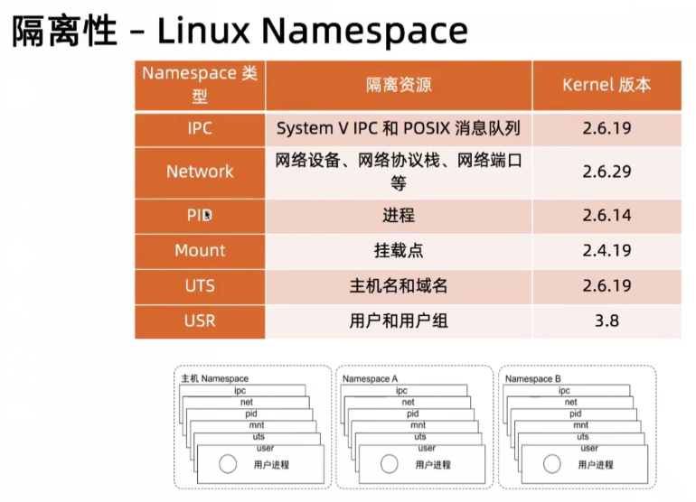
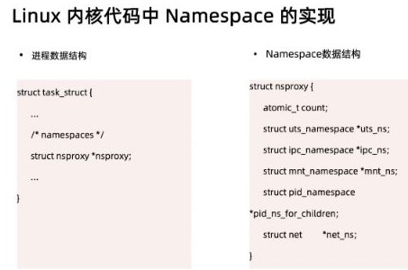
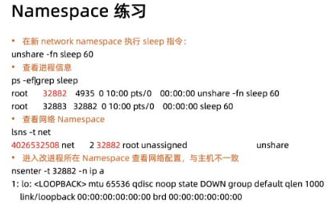
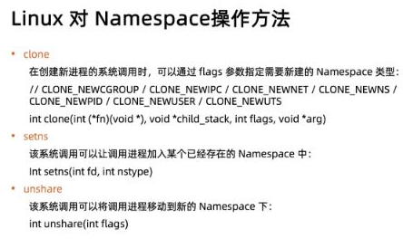
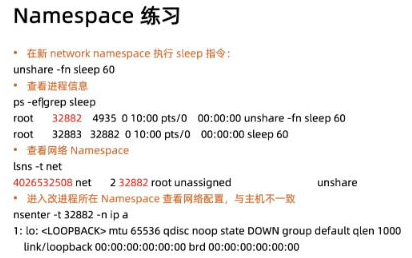

= namespace

作用

. 系统可以为进程（任意进程）分配不同的 Namespace
. 保证不同的 Namespace 资源独立分配、进程批次隔离，即不同 Namespace 下的进程互补干扰

实例：

. shell 脚本调用，调用的脚本无法获取到被调用脚本设置的环境变量
. 新建的用户无法看到 root 用户创建的进程

== 操作

. 查询当前系统的 namespace

    lsns -t type

. 查看某进程的 namespace

    ls -la /proc/<pid>/ns

. 进入某 namespace 并执行命令

    nsenter -t <pid> -n ip addr

